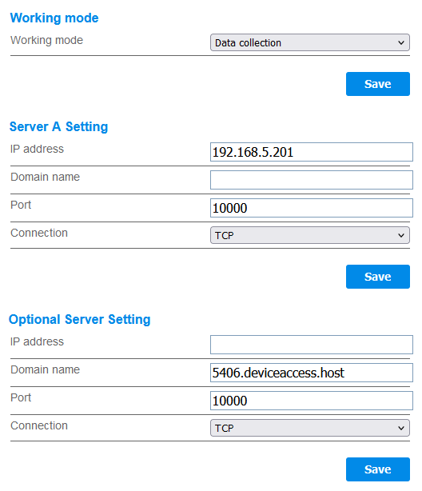

# deye-mithm
Man in the middle tracer of traffic between Deye inverter and AWS cloud.

## Motivation

The Deye SUN-M80G3-EU-Q0 somehow sucks: I do not have all truth and all details, but it seems they skipped a cutoff relay
in the inverter, which is required due to German regulations (which also do suck).

As a consequence they provided an external relay. This connects to the Modbus port of the inverter and every single
useful poll operation is blocked. Nothing on 8899 or 48899 for me on the recent firmware.

So I am using their Amazon cloud communication to have my own monitoring and logging active and still have their
cloud capabilities operative.

It might be useful for other devices as well, as it is automatically pushing information every 5 minutes.
The drawback is that we are looking at binary, undocumented communication.

## Sources

This is a modified mixture of two Github repositories.

## https://github.com/Hypfer/deye-microinverter-cloud-free

Provides the idea how to interpret the binary data sent into the Amazon cloud.
However I want no keep the cloud connectivity, just tee the packets and replicate them
to my own logger, which is a Splunk HEC (http Event Collector). The original provides a dummy server.

## https://github.com/ickerwx/tcpproxy

Provides the idea how to implement a proxy, however that thing may get berserk in the communication
between Inverter and Cloud (an Amazon TCP load balancer) from time to time for unknown reasons.
Maybe this is caused by improper handling of socket close reset packets received.
I tried to reimplement it, not to nice in terms of the modules, but maybe better in terms of state handling.
A master listens on a port, on incoming connection a child thread is created.
The child thread forks two communication threads, one for each direction.
You are not supposed to kill a thread, so it will be in an endless timeout / try to read data loop.
If one of these sockets die the thread exits, the intermediate controller closes the two sockets, so
the other directional transport thread dies as well.

# Configuration

## Inverter

 * Variant 1: Fake the DNS entry for the Cloud server the Deye is talking to. You may need to configure the
   cloud server in the source code, it comes with the factory setting for an Amazon Frankfurt loadbalancer. 
 * Variant 2: Reconfigure the Deye using the hidden configuration page at /config_hide.html. You might need to
   change the server in the source code from its factory of an Amazon Frankfurt loadbalancer.
   

## Code

Just the relevant packets are selected and printed. I need to feed these into a Splunk logger.
Configuration is in the optional file `config.json`.
